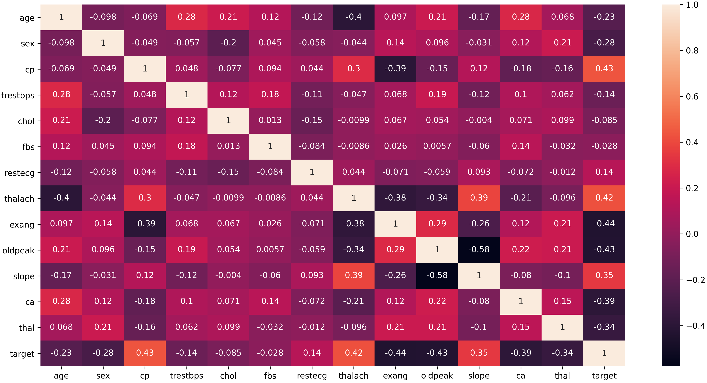
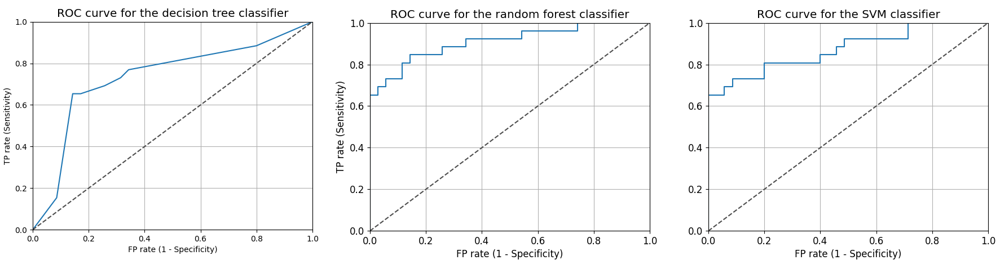
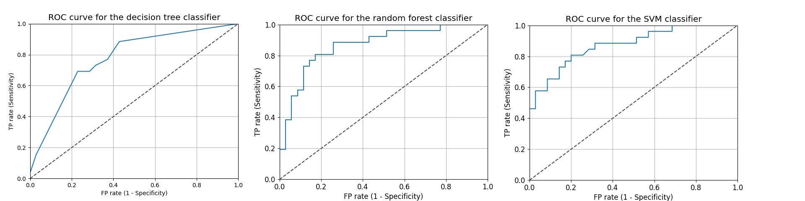
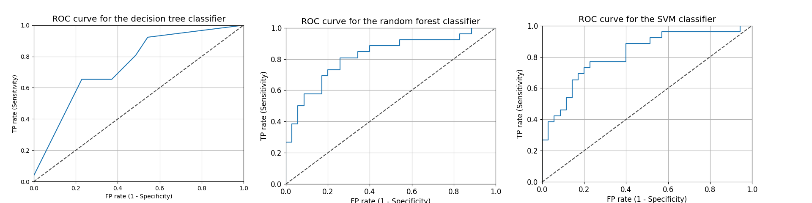

# Heart disease prediction
## Algorithms used
1) Decision trees
2) Random forest
3) SVM

## Data
[Cleveland heart disease data set 2016](https://archive.ics.uci.edu/ml/datasets/heart+disease)

Correlations using Pearson's coefficient

#
## Results
### Model trained on all 14 attributes

|             | Decision tree | Random forest | SVM      |
| ----------- | -----------   | -----------   |--------- |
| Accuracy    | 0.75          | 0.84          | 0.8      |
| Sensitivity | 0.76          | 0.88          | 0.85     |
| Specificity | 0.74          | 0.79          | 0.75     |
| AUC         | 0.73          | 0.91          | 0.87     |
| MAE         | 0.25          | 0.18          | 0.2      |
| RMSE        | 0.5           | 0.4           | 0.44     |

#
### Model trained on top four most correlated attributes with the target attribute.

|             | Decision tree | Random forest | SVM      |
| ----------- | -----------   | -----------   |--------- |
| Accuracy    | 0.7           | 0.75          | 0.8      |
| Sensitivity | 0.76          | 0.76          | 0.87     |
| Specificity | 0.64          | 0.64          | 0.73     |
| AUC         | 0.78          | 0.78          | 0.88     |
| MAE         | 0.3           | 0.3           | 0.2      |
| RMSE        | 0.54          | 0.54          | 0.44     |

#
### Model trained on top three most correlated attributes (without oldpeak) with the target attribute.
|             | Decision tree | Random forest | SVM      |
| ----------- | -----------   | -----------   |--------- |
| Accuracy    | 0.64          | 0.75          | 0.75     |
| Sensitivity | 0.71          | 0.83          | 0.81     |
| Specificity | 0.57          | 0.68          | 0.69     |
| AUC         | 0.75          | 0.83          | 0.81     |
| MAE         | 0.36          | 0.25          | 0.25     |
| RMSE        | 0.6           | 0.5           | 0.5      |

